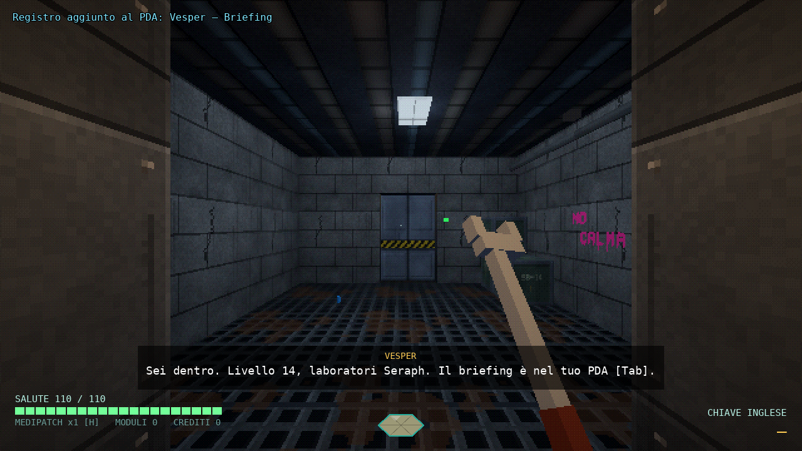
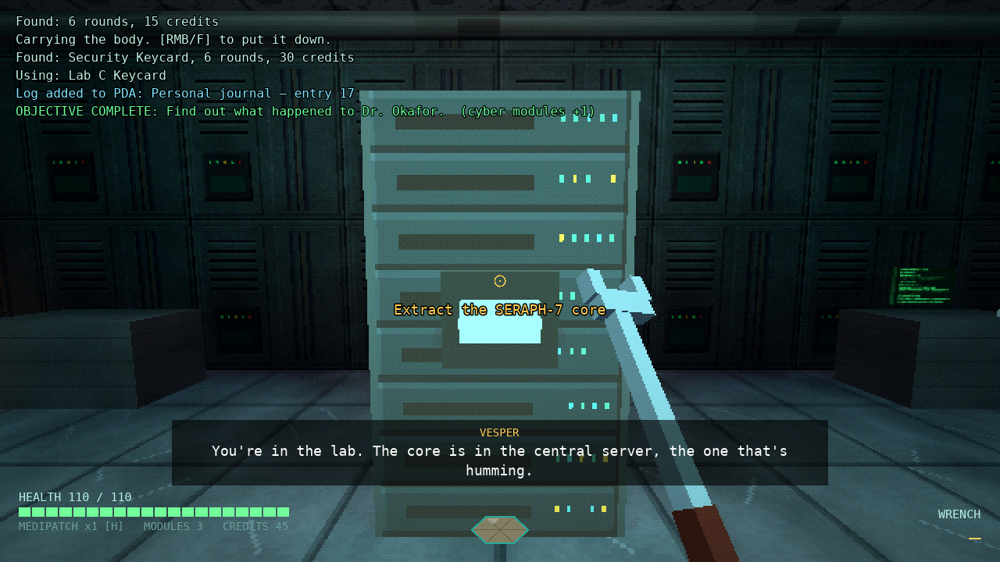
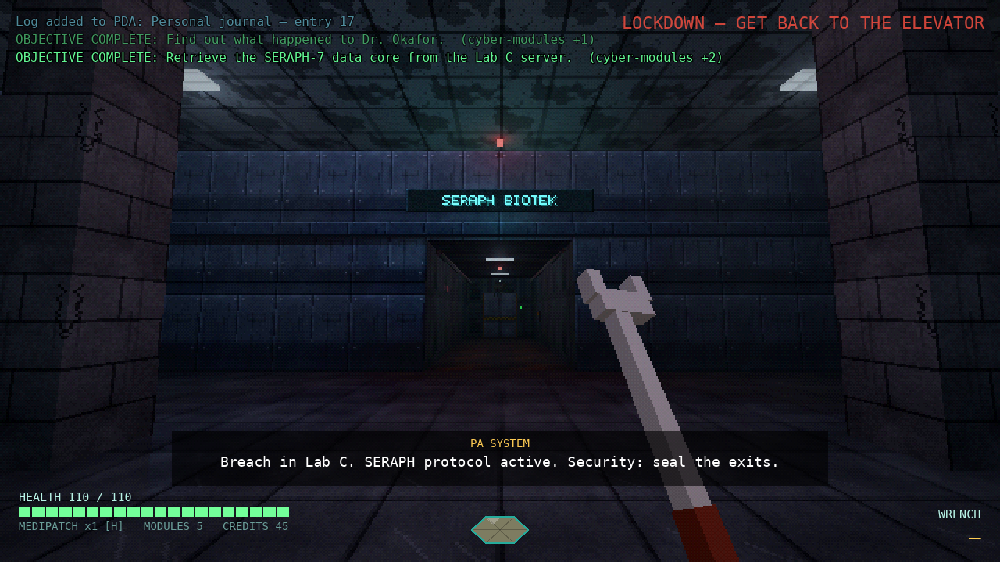
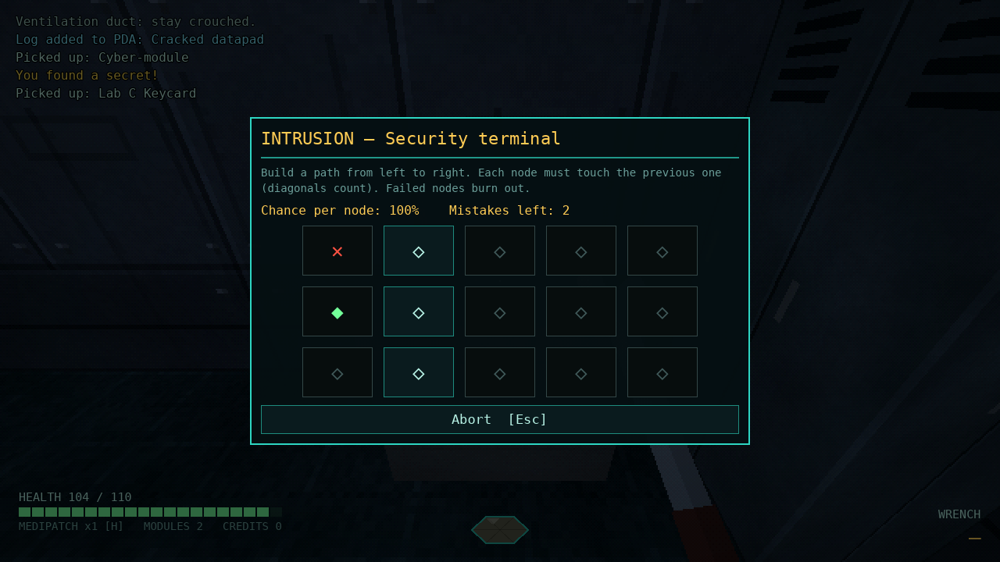
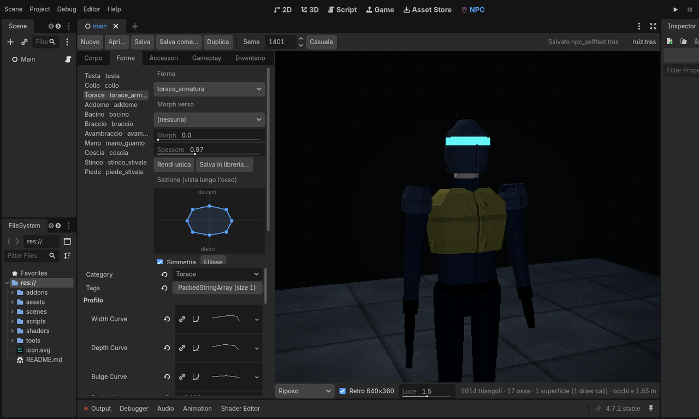
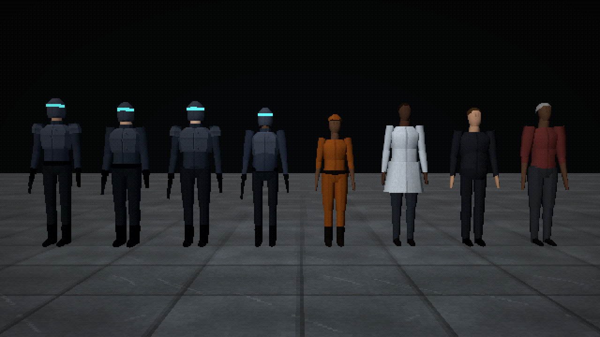

# PROTOCOLLO SERAPH — vertical slice

Immersive sim FPS/RPG cyberpunk in **Godot 4.7**, con grafica in stile **Dark Engine**
(il motore di *Thief* e *System Shock 2*): texture a 64 px con filtro nearest, rendering
a 640×360 con dithering a 15 bit, geometria scavata a brush, pozze di luce e buio vero.

Arcologia Nysa, livello 14, turno di notte. Sei salito con l'ascensore di servizio
nell'ala laboratori della Seraph Biotek: devi estrarre il nucleo dati **SERAPH-7** dal
Laboratorio C e tornare all'ascensore. Come ci arrivi è affar tuo.

| | |
|---|---|
|  |  |
|  |  |

## Avvio

1. Installa **Godot 4.7.x** (testato su 4.7.2 stable, build standard, non serve .NET).
2. Apri `project.godot` dall'editor: al primo avvio importa texture e suoni (pochi secondi).
3. Premi **F5**. Nel menu iniziale distribuisci 4 punti fra le skill e inizia.

Una partita dura 10–25 minuti. Nessun asset esterno: texture e suoni sono generati dagli
script in `tools/` e sono già inclusi.

**Vuoi modificare la mappa o farne una nuova?** I livelli sono scene che si modificano
nell'editor di Godot: leggi la [guida all'editor](docs/GUIDA_EDITOR.md), che parte da zero.

## Comandi

| Tasto | Azione |
|---|---|
| WASD | movimento |
| Shift | corsa (rumorosa) |
| Ctrl (tieni) / C (alterna) | accovacciati |
| Spazio | salto; davanti a una sporgenza o a un condotto ti ci arrampichi (mantle) |
| Q / E | sporgiti a sinistra / destra |
| Mouse sinistro | attacca (chiave inglese / pistola), lancia l'oggetto in mano |
| Mouse destro o F | **frob**: usa, raccogli, leggi, apri, perquisisci, posa |
| 1 / 2, rotella | chiave inglese / pistola |
| R | ricarica |
| H | medipatch |
| Tab | PDA (obiettivi, registri, inventario, personaggio) |
| Esc | pausa e opzioni |
| F2 / F3 | risoluzione interna (1280×720 → 320×180) / dithering |

I comandi sono nella Mappa input del progetto e si possono rimappare dall'editor.

## Cosa c'è nella slice

**Mappa** — ascensore di servizio, corridoio di servizio, hall a doppia altezza con
telecamera, sala sicurezza (con finestra sulla hall), magazzino, sala relax con stazione
di potenziamento, corridoio con torretta, Laboratorio C con il server, rete di condotti
di ventilazione con un ramo segreto.

**Sistemi**
- **Visibilità dalla luce**: ogni luce contribuisce con raycast di occlusione; la gemma in
  basso mostra quanto sei visibile. Accovacciarsi e stare fermi aiuta, correre no. Le
  plafoniere si possono spegnere (interruttori) o rompere (rumore di vetri).
- **Rumore**: i passi dipendono da superficie (grata, metallo, cemento, moquette), velocità
  e skill; urti di oggetti, spari, porte, grate e corpi che cadono sono eventi udibili,
  attenuati dai muri. Gli archi accanto alla gemma mostrano quanto rumore fai.
- **Guardie**: percezione continua (awareness) con cono visivo e udito; stati pattuglia →
  sospetto/indagine → combattimento → ricerca; si chiamano a vicenda, trovano i corpi,
  aprono le porte (hanno l'accesso). Visiera e icona sopra la testa mostrano lo stato.
- **Stealth "non letale"**: colpo di chiave inglese alle spalle = KO; perquisizione e
  borseggio; trasporto dei corpi per nasconderli.
- **Sicurezza**: telecamere (il loro cono di luce ti illumina davvero) che fanno scattare
  l'allarme; torretta a sensori ottici; terminale di sicurezza per spegnerle.
- **Serrature**: tessere, tastierini con codice, hacking. Il minigioco di hacking (alla
  System Shock 2) ha probabilità per nodo che dipendono dalla skill; fallire blocca il
  dispositivo e sui sistemi protetti può far scattare l'allarme.
- **RPG**: 4 skill (Hacking, Armi da fuoco, Forza, Furtività) con effetti concreti su
  porte accessibili, grate, precisione, rumore, visibilità, salute. I cyber-moduli
  (trovati, o ricompense degli obiettivi) si spendono alla stazione di potenziamento.
- **Mondo fisico**: lattine, bottiglie e scatole si raccolgono e si lanciano per
  distrarre; mantle su casse e dentro i condotti.
- **Narrativa ambientale**: 8 registri (datapad e terminali) raccontano cosa sta facendo
  il Dr. Okafor con gli impianti CALMA; sottotitoli per Vesper, il PA e le battute delle
  guardie.
- **Struttura di missione**: obiettivo principale + 3 opzionali (Okafor, nessuna vittima,
  nessun allarme), lockdown con rinforzo dopo il furto del nucleo, 2 segreti,
  schermata finale con statistiche e valutazione.

## Soluzioni (spoiler)

| Ostacolo | Modi per superarlo |
|---|---|
| Hall sorvegliata | ombre lungo la parete est; spegnere le telecamere dal terminale; sparare alla telecamera (rumoroso); correre il rischio |
| Porta della sala sicurezza | codice **0451** (nel promemoria in sala relax); Tessera Sicurezza (borseggio o KO sulla guardia della hall); hack livello 1 |
| Guardia in sala sicurezza | alle spalle col colpo di chiave; attirarla lontano con un rumore; ignorarla |
| Terminale di sicurezza | Tessera Sicurezza o hack livello 1 → spegne telecamere e torretta |
| Torretta del corridoio | terminale; pannello di manutenzione (Hacking 2 la spegne, Hacking 3 la mette contro le guardie); distruggerla a colpi di pistola; rompere le luci del corridoio (pistola, o chiave inglese da sotto): con i sensori ottici al buio vede solo nel suo fascio, che puoi schivare accovacciato |
| Porta del Laboratorio C | Tessera Laboratorio (sul tavolino accanto all'armadietto, in sala sicurezza); hack livello 2; oppure non usarla affatto |
| Condotto | grata della sala relax (Forza 1 per toglierla in silenzio, altrimenti sfondala) → condotto → Laboratorio, saltando torretta, porta e telecamera del corridoio |
| Ritorno dopo il lockdown | un rinforzo pattuglia il corridoio di servizio: evitalo, mettilo KO o combatti |

## Come è fatto il look Dark Engine

- **Brush sottrattivi** (`scripts/world/level/`): nella scena del livello un blocco solido
  (`Solido`) viene scavato da volumi d'aria (`Brush` dentro le `Zone`), come in DromEd.
  All'avvio `LevelBuilder` "compila" il CSG in mesh statiche e una collisione trimesh.
- **Zone di luce**: ogni triangolo è assegnato alla zona (stanza) del brush che l'ha
  generato e ogni zona è un bit dei render layer. Le luci illuminano solo la loro zona:
  la luce non attraversa i muri anche senza ombre, come con le lightmap del Dark Engine.
  Guardie e oggetti aggiornano il proprio layer in base alla stanza in cui si trovano.
- **Texture a densità costante**: lo shader `shaders/level_surface.gdshader` proietta in
  spazio mondo texture diverse per pavimento, soffitto e pareti, filtro nearest + mipmap.
- **Bassa risoluzione**: il mondo è renderizzato in un `SubViewport` (default 640×360) e
  scalato senza filtro; `shaders/retro_post.gdshader` quantizza a 32 livelli per canale con
  dithering Bayer 4×4. HUD e menu restano a piena risoluzione.
- **Renderer Compatibility** (OpenGL 3.3): gira ovunque; poche luci con ombre nella hall
  e nel laboratorio, il resto a zone.

## Creatore di NPC



Plugin dell'editor (`addons/npc_creator`, già attivo): scheda **NPC** nella barra in alto,
accanto a 2D, 3D e Script. A sinistra le schede con i controlli, a destra l'anteprima 3D
che gira nello stesso SubViewport 640×360 con dithering del gioco (disattivabile), con
le pose Riposo, Cammina, Corri, Mira e A terra, una luce regolabile per vedere l'NPC al buio
e uno sfondo a scelta (buio come in gioco, grigio, chiaro, due colori di contrasto o
personalizzato, con o senza pavimento): sugli NPC scuri uno sfondo chiaro fa leggere la sagoma.

- **Corpo**: nome, archetipo, fazione; altezza, corporatura, spalle, fianchi, braccia,
  gambe, testa, collo, postura; i 7 colori della tavolozza (pelle, uniforme, secondario,
  armatura, stivali e guanti, capelli, luce di visore e impianto CALMA).
- **Forme**: le 11 parti del corpo (testa, collo, torace, addome, bacino, braccio,
  avambraccio, mano, coscia, stinco, piede). Per ognuna: la forma della libreria, un morph
  verso una seconda forma, lo spessore, la **sezione** (trascini i vertici dell'anello,
  con simmetria) e sotto, nell'Inspector integrato, le **curve di profilo** (larghezza,
  profondità, sporgenza in avanti) con l'editor di curve di Godot, raggi, anelli, lati,
  sovrapposizione alle articolazioni, materiale.
- **Accessori**: casco, visore, impianto CALMA, colletto, spallacci, cintura, pistola,
  capelli, berretto, cuffia, falda del camice... ognuno agganciato a un osso, con
  posizione, direzione, lunghezza e specchiatura sui due lati.
- **Gameplay**: vista, cono visivo, prontezza, udito, salute, precisione, danno, tempo di
  reazione, velocità; se va a controllare i rumori, se dà l'allarme per un corpo, se
  risponde agli allarmi, se chiama rinforzi.
- **Inventario**: munizioni, crediti, medipatch, tessera; battute di ronda.

In alto: **Nuovo** (NPC casuale dell'archetipo), **Apri**, **Salva**, **Salva come**,
**Duplica**, **Seme** e **Casuale** (stesso seme = stesso aspetto). Un clic su una parte
nell'anteprima la seleziona. Ogni modifica si annulla con Ctrl+Z. Aprire un file
`.tres` di un NPC dal FileSystem lo carica nel creatore. Prima di lasciare un NPC con
modifiche non salvate il creatore chiede **Salva / Scarta / Annulla**; **Scarta** lo
riporta esattamente com'è su disco. **Salva come** lascia il file di prima com'era (con
i livelli che lo usano) e continua sulla copia; salvare sopra un file già usato da un
livello aperto aggiorna i dati senza staccare il livello dal file. Il Ctrl+S dell'editor,
come fa Godot con tutte le risorse modificate, salva anche l'NPC aperto (se ha già un
file) e le forme di libreria cambiate con «Modifica la libreria»; un NPC mai salvato resta
da salvare, con un avviso nell'Output (chiudendo l'editor, «Salva» gli dà un nome libero
in `assets/npc/characters/`). Se l'NPC è stato modificato dagli Inspector integrati,
aprirne un altro azzera la cronologia di annulla globale, così un Ctrl+Z non può cambiare
l'NPC appena chiuso. Una forma di libreria cambiata fuori dal creatore (Inspector
principale) resta una modifica normale di Godot: Scarta non la tocca.

**Libreria e file.** Le forme sono file in `assets/npc/segments/` condivisi fra gli NPC,
e nel creatore sono **bloccate**: la nota dice quali personaggi usano la forma.
**Rendi unica** ne fa una copia dentro l'NPC, da modificare liberamente; **Salva in
libreria** la trasforma in un nuovo file riutilizzabile (la forma di partenza resta com'è).
Per cambiare davvero una forma per tutti si attiva **Modifica la libreria**: la forma
viene salvata nel suo file insieme all'NPC. Gli NPC sono `NPCDefinition` in
`assets/npc/characters/`. Il generatore casuale pesca fra le forme della libreria
(quelle con un tag d'archetipo, es. `guardia`, restano all'uniforme giusta), quindi una
forma nuova entra subito nel mescolamento.



**Come è fatto il corpo.** Scheletro di 17 ossa calcolato dalle proporzioni (rotazione di
riposo nulla: la stessa animazione vale per ogni corporatura). Ogni segmento è un loft di
anelli low-poly lungo il proprio osso, con pesi rigidi e sovrapposizione alle
articolazioni come in System Shock 2. Corpo e accessori finiscono in **una sola mesh con
un solo materiale** condiviso (atlante `npc_atlas.png` in scala di grigi + colori nei
vertex color; visore e impianto CALMA emissivi, tinti per istanza secondo lo stato della
guardia). La mesh si genera al caricamento (circa 5 ms per NPC) e resta in cache.
L'animazione è procedurale sulle ossa, guidata dalla stessa fase dei passi udibili;
le guardie lontane aggiornano la posa meno spesso.

| Guardie nella hall | draw call con le vecchie primitive | draw call con la mesh unica |
|---|---|---|
| 14 | 970 | 406 |
| 29 | 1558 | 451 |
| 54 | 2720 | 559 |
| 104 | 5264 | 788 |

(`--autotest --stress` con un display; restano più draw call per guardia perché il
renderer Compatibility disegna una passata per ogni luce e ombra che la tocca.)

**Usare un NPC nel livello.** Trascina `scenes/entities/guard.tscn` nel livello e, nella
proprietà **Definition**, trascina il personaggio da `assets/npc/characters/` (nell'editor
la guardia prende subito il suo aspetto). La definizione dice chi è (aspetto, sensi,
bottino, battute); il livello dove sta e che giro fa (**Patrol Route**). Da codice:
`Guard.new().setup_def(def, posizione, direzione, percorso)`. Per rigenerare libreria e personaggi predefiniti:
`godot --headless --path . --script tools/npc_seed.gd -- --force`. Per una foto di gruppo:
`xvfb-run godot --path . --script tools/npc_lineup.gd -- --out=/tmp/npc.png --retro`.

## Struttura del progetto

```
levels/seraph/seraph.tscn   LA MAPPA: geometria, luci, porte, oggetti, guardie (si modifica nell'editor)
levels/seraph/seraph.gd     logica della missione: obiettivi, battute, lockdown
levels/palestra/            livello vuoto da cui partire (vedi la guida)
levels/guida/               il livello costruito passo passo in docs/GUIDA_EDITOR.md
scenes/main.tscn            scena principale: carica il livello, HUD e menu
scenes/entities/*.tscn      entità da trascinare nei livelli (porte, luci, guardie, datapad…)
scenes/props/*.tscn         arredo: scatole, pannelli, cilindri
assets/surfaces/*.tres      SurfaceSet: texture e passi delle superfici delle stanze
scripts/main.gd             SubViewport retro, HUD, UI, input globale
scripts/core/game.gd        autoload Game: skill, inventario, obiettivi, rumore, allarmi
scripts/core/sfx.gd         autoload Sfx: suoni 2D/3D e loop
scripts/core/util.gd        materiali nearest, primitive, raycast, evidenziazione frob
scripts/core/layers.gd      layer di collisione (mondo, player, npc, porte…)
scripts/core/effects.gd     scintille, polvere, traccianti, lampi
scripts/world/level/        Level (base dei livelli), LevelGeometry, Zone, Brush, SurfaceSet,
                            LevelBuilder (brush → mesh a zone → collisione)
scripts/world/*.gd          porte, luci, pickup, datapad, oggetti fisici, grate, terminale,
                            stazione di potenziamento, nucleo, ascensore, interruttori, trigger,
                            percorsi di ronda, PlayerStart
scripts/world/props/        PropBox, PropQuad, PropCylinder
scripts/actors/player.gd    controller, mantle, lean, visibilità, passi, armi, frob, trasporto
scripts/actors/guard.gd     IA guardia (percezione, stati, KO, borseggio, corpi), legge una NPCDefinition
scripts/npc/*.gd            NPC: definizione, forme, scheletro, costruzione della mesh, corpo animato, libreria
scripts/actors/security_camera.gd, turret.gd, turret_panel.gd
scripts/ui/hud.gd           gemma di luce, rumore, salute, arma, prompt, sottotitoli
scripts/ui/ui_root.gd       menu, PDA, serrature/tastierino, hacking, potenziamento, terminali, fine
scripts/data/logs.gd        testi dei registri
addons/npc_creator/         plugin dell'editor: creatore di NPC (scheda "NPC")
assets/npc/segments/        libreria delle forme dei segmenti (.tres)
assets/npc/characters/      definizioni degli NPC: Ruiz, Hale, Kovač, Mori (.tres)
shaders/npc_body.gdshader   materiale unico degli NPC (atlante + vertex color + luce per istanza)
tools/validate_level.gd     validatore dei livelli (gira anche a ogni F6)
tools/autotest.gd           test end-to-end
tools/convert_seraph.gd     il convertitore usato una volta per passare dalla mappa in codice alla scena
tools/npc_seed.gd           scrive libreria e personaggi predefiniti
tools/npc_lineup.gd         foto di gruppo degli NPC (verifica visiva)
tools/gen_textures.py       generatore delle texture (Python + numpy + Pillow)
tools/gen_sounds.py         generatore degli effetti sonori
```

## Estendere la mappa

Tutto si fa nell'editor: apri `levels/seraph/seraph.tscn` (o la palestra), scava stanze con
i `Brush` dentro le `Zone`, trascina le entità da `scenes/entities/`, premi **F6** per
provare. La [guida all'editor](docs/GUIDA_EDITOR.md) spiega tutto passo passo.

Dal lato codice: i registri si aggiungono in `scripts/data/logs.gd`; la logica di missione
di un livello si scrive estendendo `Level` (vedi `levels/seraph/seraph.gd`: `setup_mission`,
`start_intro`, `on_lockdown`). Un oggetto qualsiasi diventa interattivo se ha i metodi
`get_frob_text()` e `frob(player)`; un bersaglio se ha `take_damage(amount, hit_pos, dir,
kind)`; una serratura se espone `get_lock_info()`, `try_code()` e `on_hack_result()`. Le
entità nuove seguono lo schema di quelle esistenti: script `@tool` con proprietà `@export`
commentate (il commento diventa il tooltip dell'Inspector) e una scena in
`scenes/entities/`.

## Test automatico

```
godot --headless --path . -- --autotest            # 63 controlli: navmesh, frob, porte, codice,
                                                   # hacking, telecamera, torretta, IA, KO, borseggio,
                                                   # lancio, mantle nel condotto, lockdown, estrazione
godot --headless --path . -- --autotest --death    # morte, schermata "segnale perso", riavvio
godot --headless --path . -- --autotest --ui       # preme i bottoni veri di menu, PDA, pausa, tastierino
godot --headless --path . -- --level=res://levels/guida/guida.tscn --autotest --guida
godot --headless --path . -- --validate --level=res://levels/palestra/palestra.tscn   # validatore
godot --headless --path . -- --autotest --npc      # generatore di NPC: libreria, personaggi, mesh, ossa, pose, cache
NPC_CREATOR_SELFTEST=1 godot --headless --editor --path .   # il creatore nell'editor: controlli, Ctrl+Z,
                                                   # forme bloccate, Rendi unica, Salva come, Scarta, Ctrl+S,
                                                   # cronologia della scena (scrive solo in user://)
godot --path . -- --autotest --stress              # 10/25/50/100 guardie: tempo di frame (media e 95%)
                                                   # e draw call (non passa/fallisce)
godot --path . -- --autotest --shots --shot-dir=/percorso   # anche screenshot (serve una GPU/display)
```

La CI (`.github/workflows/test.yml`) esegue i test, valida tutti i livelli in `levels/` e li
apre nell'editor per scovare errori negli script `@tool`.

Rigenerare gli asset: `python3 tools/gen_textures.py` e `python3 tools/gen_sounds.py`
(servono `numpy` e `Pillow`), poi riapri l'editor per il reimport.

## Limiti noti / prossimi passi

- Niente salvataggio/caricamento (il classico quicksave F5/F9 è il prossimo pezzo naturale).
- Le guardie sono modelli low-poly skinnati generati dal creatore di NPC, ma l'animazione
  è ancora procedurale (passo, corsa, mira, respiro, caduta): mancano clip vere (colpito,
  perquisizione, reazioni) e le armi in prima persona sono ancora primitive.
- Il creatore modella i segmenti con curve e sezione; mancano le maniglie per trascinare
  gli anelli direttamente nella vista 3D.
- Il suono si attenua con raycast diretti; il Dark Engine propagava il suono lungo le stanze
  (portali): con le zone già presenti si può fare un grafo stanza→stanza.
- Una sola arma da fuoco e nessun tipo di munizione alternativo.
- Il renderer Compatibility limita le ombre dinamiche; con Forward+ si possono accendere su
  più luci (il progetto funziona anche lì, basta cambiare il renderer).
