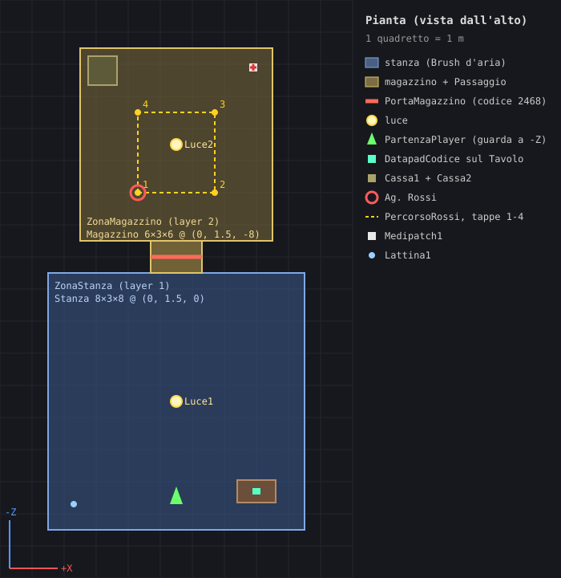
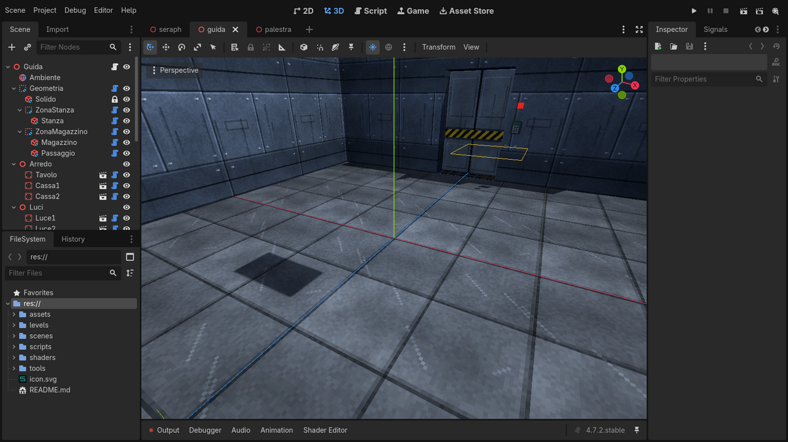
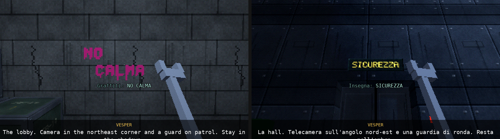

# Costruire livelli nell'editor di Godot

Questa guida parte da zero: non serve conoscere Godot, Blender o TrenchBroom. Alla fine
avrai costruito da solo due stanze collegate da una porta col codice, una luce che
sfarfalla, un datapad, una guardia di ronda e qualche oggetto, e saprai come mettere le
mani sulla mappa di Seraph. Tempo: un'oretta.

Il risultato finito è già nel progetto, in `levels/guida/guida.tscn`: se ti blocchi,
aprilo e confronta.



---

## 0. Tre idee prima di cominciare

**1. Non si costruiscono muri: si scava.** Ogni livello parte da un blocco pieno e
invisibile (il `Solido`). Le stanze sono scatole d'aria (`Brush`) scavate dentro il
blocco. Quello che resta del blocco sono i muri, i pavimenti e i soffitti. Due stanze
separate da 1 m di pieno hanno un muro spesso 1 m; per collegarle scavi un terzo brush,
il passaggio. È il metodo di DromEd, l'editor di *Thief* e *System Shock 2*.

**2. Una stanza = una zona.** Ogni `Zone` raggruppa i brush di una stanza e ha un numero
(il suo *layer*, da 1 a 20). Le luci illuminano solo la zona in cui si trovano: così la
luce non passa attraverso i muri. Un passaggio fra due stanze appartiene a tutte e due
(lo dici spuntando la seconda zona in *Extra Zones*).

**3. Tutto il resto si trascina.** Porte, luci, guardie, datapad, casse… sono scene
pronte in `scenes/entities/` e `scenes/props/`. Le trascini nel livello e regoli le
proprietà nell'Inspector. **Passa il mouse sul nome di una proprietà** per leggere a cosa
serve.

Unità: metri. L'asse **Y va in alto**, il pavimento è a `y = 0`. Nella vista dall'alto
**-Z è "nord"** (in alto nella pianta qui sopra) e +X è a destra.

---

## 1. L'editor in dieci minuti

**Aprire il progetto.** Avvia Godot 4.7, nel Project Manager scegli *Import*, seleziona il
file `project.godot` della cartella del gioco e poi *Edit*.

**Lingua dell'editor.** Nella guida uso i nomi inglesi dei menu, come quasi tutti i
tutorial. Se il tuo editor è in italiano puoi passare all'inglese da *Editor → Editor
Settings → Interface → Editor → Editor Language* (serve riavviare l'editor), oppure
tenerlo in italiano e cercare la voce corrispondente.

**Lingua del gioco.** Il gioco è in **inglese**, con l'italiano come traduzione: tutto quello
che il giocatore legge e che scrivi nel livello (nomi delle porte, battute, registri,
nomi delle guardie) va scritto **in inglese**. La traduzione italiana si aggiunge dopo, in
un file a parte: è spiegato nella sezione 7. Gli strumenti (validatore, scheda NPC,
questa guida) restano in italiano.

**I pannelli.**



- **Scene** (in alto a sinistra): l'albero dei nodi del livello. È il modo più sicuro per
  selezionare le cose.
- **FileSystem** (in basso a sinistra): i file del progetto. Da qui trascini scene,
  texture e SurfaceSet.
- **Inspector** (a destra): le proprietà del nodo selezionato.
- **Viewport 3D** (al centro) e, in basso, **Output**: lì compaiono i messaggi quando provi
  il livello.

**Muoversi nella vista 3D.**

| Comando | Cosa fa |
|---|---|
| tieni premuto il **tasto destro** + `W A S D` | volo libero (`Q`/`E` giù/su, `Shift` più veloce, rotella per la velocità) |
| rotella | zoom |
| tasto centrale trascinato | ruota attorno al punto guardato |
| `F` | inquadra il nodo selezionato |
| menu *Perspective* in alto a sinistra nella vista → *Top View* | vista dall'alto (utilissima per le piante) |

**Strumenti:** `Q` seleziona, `W` sposta, `E` ruota. Non usare `R` (scala) sui brush e
sulle entità: per cambiare le dimensioni usa la proprietà **Size**.

**Snap alla griglia.** Accendi la calamita nella barra della vista (*Use Snap*, tasto `Y`)
e in *Transform → Configure Snap* metti *Translate Snap* a `0.25`. Con lo snap acceso anche
le maniglie dei brush (i pallini sulle facce, per allungarli) scattano sulla griglia.

**Numeri esatti.** All'inizio è più facile scrivere i valori nell'Inspector che trascinare:
la posizione è in *Node3D → Transform → Position*.

**Scorciatoie da ricordare.**

| Tasti | Azione |
|---|---|
| `Ctrl+A` | aggiungi un nodo figlio (cerca per nome, es. "Brush") |
| `Ctrl+Shift+A` | aggiungi una scena figlia (es. `door.tscn`) |
| `Ctrl+D` | duplica |
| `F2` | rinomina |
| `Ctrl+S` / `Ctrl+Z` | salva / annulla |
| `F6` | prova **la scena aperta** (il livello su cui lavori) |
| `F5` | avvia il gioco completo (menu → Seraph) |
| `F8` | ferma il gioco |

**Esercizio.** Apri `levels/seraph/seraph.tscn` (doppio clic nel FileSystem). Espandi
`Geometria → ZonaHall` e clicca `Hall1`: nell'Inspector vedi *Size* e *Surface*, nella vista
il brush evidenziato. Premi `F6` e gioca un minuto. Se hai toccato qualcosa, chiudi la scena
senza salvare.

---

## 2. Com'è fatto un livello

```
Guida                  script level.gd: all'avvio compila tutto
├─ Ambiente            WorldEnvironment: nebbia e luce ambiente
├─ Geometria           LevelGeometry: qui dentro si scava
│  ├─ Solido           il blocco pieno (invisibile e bloccato 🔒)
│  ├─ ZonaStanza       Zone, layer 1
│  │  └─ Stanza        Brush d'aria
│  ├─ ZonaMagazzino    Zone, layer 2
│  │  ├─ Magazzino     Brush d'aria
│  │  └─ Passaggio     Brush d'aria, Extra Zones = 1
│  └─ Solidi           (facoltativo) Brush di materia: pilastri, gradini, fasce
├─ Arredo  Luci  Porte  Dispositivi  Oggetti  Guardie  Trigger
└─ PartenzaPlayer      PlayerStart: dove compare il giocatore
```

Le cartelle `Arredo`, `Luci`, `Porte`… sono semplici `Node3D` per tenere ordine: il gioco
non guarda in quale cartella metti le cose.

Quando premi Play il livello: trasforma i brush in mesh e collisioni, dà a ogni oggetto la
zona in cui si trova, calcola la navmesh (dove possono camminare le guardie), crea il
giocatore sul PlayerStart e controlla il livello con il **validatore** (sezione 5).

---

## 3. La tua prima stanza

Apri `levels/palestra/palestra.tscn` e premi `F6`: una stanza vuota con una luce. Da qui
costruirai il resto della pianta. Salva spesso (`Ctrl+S`). Se combini un pasticcio:
*Scene → Reload Saved Scene*.

### 3.1 Una nuova zona

1. Nell'albero seleziona `Geometria`, premi `Ctrl+A`, cerca **Zone** e premi *Create*.
2. Rinominala `ZonaMagazzino` (`F2`).
3. Nell'Inspector la proprietà **Layer** è una griglia di 20 quadratini. Il primo in alto a
   sinistra è il layer 1: spegnilo e accendi il secondo. Ne deve restare acceso **uno
   solo**, e ogni zona deve avere il suo. Se sbagli, accanto al nodo compare un triangolo
   giallo ⚠: passaci sopra col mouse per leggere il problema.

   *(Passando il mouse sui quadratini vedi i nomi delle zone di Seraph: sono solo
   etichette, ignorali.)*

### 3.2 Il volume d'aria

1. Seleziona `ZonaMagazzino`, `Ctrl+A`, cerca **Brush**, *Create*. Rinominalo `Magazzino`.
2. Nell'Inspector: **Size** `(6, 3, 6)`; **Position** `(0, 1.5, -8)`. La posizione è il
   *centro* del brush: con altezza 3 il centro sta a 1.5, così il pavimento è a 0.
3. **Surface**: trascina `assets/surfaces/magazzino.tres` dal FileSystem sulla casella.
   Il SurfaceSet decide le texture di pareti, pavimento e soffitto e il rumore dei passi.

Guarda dall'alto (*Top View*): il magazzino è a nord della stanza, separato da 1 m di muro
(da `z = -5` a `z = -4`). Premi `F6`: il magazzino esiste, ma non ci puoi entrare.

### 3.3 Il passaggio

1. Seleziona `Magazzino` e duplicalo (`Ctrl+D`); rinomina la copia `Passaggio`.
2. **Size** `(1.6, 2.5, 1)`, **Position** `(0, 1.25, -4.5)`: largo 1.6 m, alto 2.5, e
   profondo esattamente quanto il muro, da `z = -5` a `z = -4`.
3. **Surface**: `assets/surfaces/cornice.tres` (il telaio metallico delle porte).
4. **Extra Zones**: accendi il quadratino 1. Il passaggio ora appartiene anche a
   `ZonaStanza` e viene illuminato dalle luci di entrambe le stanze.

`F6`: ora passi. Il magazzino però è buio.

> **Regola d'oro dei brush.** Stanza e passaggio devono *toccarsi* esattamente. Con lo snap
> acceso succede da solo. Se nell'editor vedi un muro sottilissimo dove dovrebbe esserci
> un'apertura, i due brush non combaciano: correggi *Position* e *Size* a mano.

### 3.4 Una luce

1. Nel FileSystem apri `scenes/entities/` e trascina `light.tscn` sul nodo `Luci`
   nell'albero (oppure seleziona `Luci` e premi `Ctrl+Shift+A`). Rinominala `Luce2`.
2. **Position** `(0, 2.95, -8)`: la plafoniera sta 5 cm sotto il soffitto.
3. **Energy** `2`, **Light Range** `7`, **Flicker** `0.3` per un neon che sfarfalla.

Non devi dire alla luce in che stanza è: lo capisce dalla posizione. Tieni le luci con
**Shadows** spente, tranne poche dove l'ombra conta per il gameplay: costano.

### 3.5 Una porta col codice

1. Trascina `scenes/entities/door.tscn` su `Porte`, rinominala `PortaMagazzino`.
2. **Position** `(0, 0, -4.5)`: a terra, al centro del passaggio. La porta si estende
   lungo X; se il passaggio attraversa un muro che corre da nord a sud, ruotala di 90°
   (*Rotation* Y = 90).
3. Apri il gruppo **Serratura**: **Locked** ✔, **Lock Title** `Storeroom` (in inglese:
   in italiano diventerà «Magazzino», vedi la sezione 7), **Code** `2468`.
4. **Bypass Zones**: accendi il quadratino 2. Dall'interno del magazzino la porta si apre
   sempre (le guardie le aprono comunque: hanno l'accesso).

Altri modi di aprire una porta chiusa: **Keycard Id** (una tessera con lo stesso id, a terra
o addosso a una guardia) e **Hack Level** (1-4, il livello di Hacking richiesto). Puoi
combinarli: ogni strada in più è una soluzione in più per il giocatore.

### 3.6 Il datapad con il codice

Un codice deve essere scritto da qualche parte, se no il giocatore non lo trova mai.

1. **Il testo.** I registri stanno in `scripts/data/logs.gd` (doppio clic per aprirlo).
   In fondo c'è già la voce `"codice_magazzino"`. Per scrivere i tuoi registri copia quel
   blocco, cambia l'id e il testo (in inglese), e attento a virgole e virgolette; `\n` va
   a capo. La traduzione italiana va in `locale/it.po` (sezione 7).
2. **Il tavolo.** Trascina `scenes/props/prop_box.tscn` su `Arredo`, rinominalo `Tavolo`:
   **Size** `(1.2, 0.8, 0.7)`, **Position** `(2.5, 0.4, 2.8)`, **Texture**
   `assets/textures/desk.png`, **Uv Mode** `densita`. L'origine di un PropBox è il centro:
   la y è metà dell'altezza.
3. **Il datapad.** Trascina `scenes/entities/datapad.tscn` su `Oggetti`: **Position**
   `(2.5, 0.81, 2.8)` (piano del tavolo + 1 cm; l'origine dei datapad e dei pickup è la
   base), **Log Id** `codice_magazzino`.

`F6`: leggi il datapad (tasto destro o `F`), vai alla porta, digita 2468.

### 3.7 Arredo

Due casse nel magazzino: `prop_box.tscn` su `Arredo`, **Size** `(0.9, 0.9, 0.9)`,
**Texture** `crate.png`, **Uv Mode** `adatta`; la prima a `(-2.3, 0.45, -10.3)`, la seconda
(`Ctrl+D`) sopra, a `(-2.3, 1.35, -10.3)` e ruotata di 10°. Il giocatore ci può salire
(mantle: salto davanti a una sporgenza).

Gli altri pezzi d'arredo: `prop_quad.tscn` per insegne, poster e schermi appoggiati ai muri
(guarda verso +Z: mettilo a 1-2 cm dalla parete) e `prop_cylinder.tscn` per tubi e colonne.

### 3.8 Una guardia di ronda

1. **Il percorso.** Trascina `scenes/entities/patrol_route.tscn` su `Guardie`, rinominalo
   `PercorsoRossi`. Selezionalo e aggiungi quattro `waypoint.tscn` come figli
   (`Ctrl+Shift+A`), con queste posizioni e **Wait** (secondi di sosta):

   | Tappa | Position | Wait |
   |---|---|---|
   | Tappa1 | `(-1.2, 0, -6.5)` | 3 |
   | Tappa2 | `(1.2, 0, -6.5)` | 2 |
   | Tappa3 | `(1.2, 0, -9)` | 3 |
   | Tappa4 | `(-1.2, 0, -9)` | 2 |

   Nell'editor il percorso è una linea gialla, che torna alla prima tappa. L'ordine è quello
   dei figli nell'albero.
2. **La guardia.** Trascina `guard.tscn` su `Guardie`, rinominala `Rossi`: **Position**
   `(-1.2, 0, -6.5)`, **Guard Name** `Ofc. Rossi`, **Patrol Route**: *Assign…* e scegli
   `PercorsoRossi`. Nel gruppo **Bottino (senza definizione)**: **Loot Credits** `20`.

Qui la guardia non ha una **Definition**, quindi è una guardia generica: il suo aspetto è
generato dal nome (sempre lo stesso) e il bottino è quello che scrivi tu. Per usare un
personaggio vero trascina nella proprietà **Definition** un file di
`assets/npc/characters/` (per esempio `ruiz.tres`): nell'editor la guardia cambia subito
aspetto, e sensi, mira, velocità, bottino e battute diventano quelli del personaggio. I
personaggi si creano e si modificano nella scheda **NPC** in alto (il creatore di NPC).

I nomi si scrivono in inglese col titolo davanti: `Ofc.` (agente), `Tech.`, `Dr.`, `Dir.`,
`Op.`. In italiano il titolo viene tradotto da solo («Ag. Rossi»); il cognome resta com'è.

Tieni le tappe ad almeno 0.6 m da muri e mobili: la guardia è larga 80 cm. Senza percorso
una guardia resta ferma di piantone, guardando verso la sua -Z.

`F6` e prova a passarle alle spalle (colpo di chiave inglese = KO, `F` per perquisirla).

### 3.9 Oggetti

- `pickup.tscn`: **Kind** `medpatch`, `ammo`, `module`, `credits` o `keycard` (con
  **Item Id**, lo stesso scritto nel *Keycard Id* della porta). Mettine uno in
  `(2.4, 0.02, -10.4)`.
- `throwable.tscn`: **Kind** `can`, `bottle`, `box`, `heavy`. Si raccolgono e si lanciano per
  distrarre le guardie. Una lattina in `(-3.2, 0.1, 3.2)`.

### 3.10 Controlla

Premi `F6` e guarda il pannello **Output** in basso: il validatore scrive `RISULTATO: 0
errori, 0 avvisi` oppure l'elenco dei problemi (sezione 5). Poi apri
`levels/guida/guida.tscn` e confronta.

---

## 4. Le entità

Tutte in `scenes/entities/` (e gli arredi in `scenes/props/`). Le proprietà hanno la
spiegazione nel tooltip dell'Inspector.

| Scena | Cos'è | Proprietà principali | Origine / orientamento |
|---|---|---|---|
| `light.tscn` | luce con plafoniera (si può rompere) | Color, Energy, Light Range, Flicker, Style, Shadows, Emergency | centro della plafoniera |
| `door.tscn` | porta scorrevole | Width, Height, Auto Close; *Serratura*: Locked, Code, Keycard Id, Hack Level, Bypass Zones | a terra, al centro del varco; si estende lungo X |
| `datapad.tscn` | registro da leggere | Log Id, Wall Terminal | base; il terminale a muro guarda verso +Z |
| `pickup.tscn` | oggetto da raccogliere | Kind, Amount, Item Id, Secret Id | base |
| `throwable.tscn` | lattina, bottiglia, scatola, cassa pesante | Kind | centro, poco sopra il piano |
| `guard.tscn` | guardia | Definition (un personaggio di `assets/npc/characters`), Guard Name, Patrol Route, Dormant, *Bottino (senza definizione)* | a terra; guarda verso -Z |
| `patrol_route.tscn` + `waypoint.tscn` | percorso di ronda | Wait (sulle tappe) | tappe a terra |
| `security_camera.tscn` | telecamera che fa scattare l'allarme | Sweep, Period, Pitch, Cam Range | guarda verso -Z |
| `turret.tscn` + `turret_panel.tscn` | torretta e suo pannello di manutenzione | Sweep, T Range, Start Disabled; il pannello ha Turret Path | la torretta guarda verso -Z |
| `light_switch.tscn` | interruttore | Targets (le luci che comanda) | a muro |
| `vent_grate.tscn` | grata di un condotto | Size, Pry Skill, Inner Zone | lato esterno verso +Z |
| `trigger_zone.tscn` | volume che mostra una battuta quando entri | Size, Speaker, Text (in inglese), Duration, Once | centro del volume |
| `security_terminal.tscn`, `upgrade_station.tscn`, `server_core.tscn`, `elevator_panel.tscn` | pezzi della missione di Seraph | — | — |
| `player_start.tscn` | partenza del giocatore (uno per livello) | — | a terra; il giocatore guarda verso -Z |
| `props/prop_box.tscn` | scatola: mobili, casse, vetri, schermi | Size, Texture, Uv Mode, Tint, Emission, Opacity, Collision, Caption | **centro** |
| `props/prop_quad.tscn` | pannello piatto: insegne, poster, graffiti | Size, Texture, Emission, Alpha Cut, Caption | guarda verso +Z |
| `props/prop_cylinder.tscn` | tubi, colonne, vasche | Radius, Length, Sides, Texture, Opacity | centro, asse lungo Y |

Per i **brush solidi** (pilastri, gradini, fasce): crea sotto `Geometria` un nodo
`CSGCombiner3D` chiamato `Solidi`, **sotto tutte le zone**, e mettici dentro dei Brush; in
*Extra Zones* spunta la zona della stanza in cui stanno (se no restano invisibili).

Per le **texture delle stanze**: in `assets/surfaces/` ci sono i SurfaceSet di Seraph. Per
crearne uno nuovo, duplica un `.tres` (tasto destro → *Duplicate…*) e cambia texture,
densità (*Scale*: ripetizioni per metro), colore e passi.

---

## 5. Il validatore e i problemi comuni

Ogni volta che premi `F6` su un livello, il validatore lo controlla e scrive nell'Output (e
in *Debugger → Errors*) righe come:

```
AVVISO  [Porte/PortaMagazzino] il codice 2468 non compare in nessun datapad del livello
ERRORE  [Guardie/Rossi] non può raggiungere la tappa 3 (1.20, 0.00, -10.80) del suo percorso
```

Tra parentesi quadre c'è il nodo da sistemare. **ERRORE** = qualcosa è rotto; **AVVISO** =
probabile svista.

| Sintomo o messaggio | Causa | Rimedio |
|---|---|---|
| un buco nel muro, una stanza invisibile | brush senza *Surface* | assegna un SurfaceSet |
| un muro sottile in mezzo a un passaggio | i brush non si toccano esattamente | snap acceso, correggi i numeri |
| "esce dal blocco Solido" | la stanza sporge fuori dal Solido | selezionalo nell'albero e ingrandisci *Size* (il lucchetto 🔒 serve solo a non selezionarlo per sbaglio nella vista 3D) |
| "stesso layer della zona…" | due zone con lo stesso quadratino | dai a ogni zona il suo layer |
| un oggetto è nero o non si vede | è fuori dalle stanze o dentro un muro | controlla la posizione (il validatore lo segnala) |
| una stanza illuminata dalla luce della stanza accanto | la luce è nel passaggio o nella zona sbagliata | spostala; o usa *Zones Override* |
| la guardia sta ferma | niente *Patrol Route*, o percorso con meno di 2 tappe | assegna il percorso |
| "non può raggiungere la tappa…" | tappa troppo vicina a muri o mobili, o in una stanza chiusa | spostala; ricorda che la guardia apre le porte, ma non passa dai condotti |
| "porta chiusa che non si può aprire" | Locked senza codice, tessera né hack | aggiungi almeno un modo |
| "il codice … non compare in nessun datapad" | nessun registro del livello contiene il codice | scrivilo in un registro e piazza il datapad |
| "manca il PlayerStart" | — | trascina `player_start.tscn` nel livello |
| "manca la traduzione (it) di …" | un testo nuovo del livello non è ancora in `locale/it.po` | aggiorna e traduci (sezione 7); finché manca, in italiano quel testo resta in inglese |
| "il codice … non compare nella traduzione (it)" | la traduzione del registro ha perso o cambiato il codice | correggi la frase in `locale/it.po` |
| clicco nella vista 3D e si seleziona un'altra cosa | i brush si sovrappongono | seleziona dall'albero Scene |

---

## 6. Lavorare su Seraph

La mappa della slice è `levels/seraph/seraph.tscn`: stessa struttura della palestra, più
grande (9 zone). La logica della missione (obiettivi, battute di Vesper, lockdown) sta in
`levels/seraph/seraph.gd`, l'unica parte che resta codice. Lo script cerca per nome solo il
punto `PuntoLockdown` (dove accorrono le guardie dopo il furto); il resto lo trova da sé.

**Attenzione al test automatico.** Ad ogni push GitHub gioca Seraph da solo, in inglese e in
italiano, con 72 controlli a coordinate fisse (entra dalla porta di servizio, legge quel
datapad, sale in quel condotto…). Se sposti porte, stanze o oggetti che il test usa, fallirà: è normale, va
aggiornato insieme alla mappa. Per sperimentare liberamente fai una copia (FileSystem →
tasto destro su `seraph.tscn` → *Duplicate…* → `seraph_prova.tscn`) e prova quella con `F6`.

**Un livello nuovo.** Crea una cartella in `levels/` (tasto destro → *New → Folder*), poi
duplica lì dentro `palestra.tscn` (tasto destro → *Duplicate…*) con un nuovo nome e parti da
lì. Con `F6` lo provi subito; il menu del gioco (`F5`) avvia sempre Seraph.

**I nomi dei layer.** Quelli che vedi passando il mouse sui quadratini delle zone si
cambiano in *Project → Project Settings → Layer Names → 3D Render*.

---

## 7. Testi e traduzioni

Il gioco parte in **inglese** (la prima volta sempre, poi nella lingua scelta dal giocatore
con il bottone *Language* del menu iniziale o della pausa). L'inglese è la lingua in cui si
scrivono i testi; l'italiano è una traduzione in `locale/it.po`. Se una frase non ha
traduzione, in italiano compare in inglese: il gioco non si rompe, ma è una svista.

**Cosa scrivere in inglese.** Tutto quello che legge il giocatore: *Lock Title* e *Keycard
Name* delle porte, *Display* dei pickup, *Speaker* e *Text* dei trigger, *Guard Name* e
*Loot Keycard Name* delle guardie, nome, tessera e battute dei personaggi nella scheda NPC,
i registri in `scripts/data/logs.gd`, gli obiettivi e le battute di missione in
`levels/<livello>/<livello>.gd`. I nomi dei nodi, gli id (*Log Id*, *Keycard Id*, *Item Id*)
e i commenti restano come vuoi: il giocatore non li vede.

**Aggiungere la traduzione, in tre passi.**

1. **Aggiorna il file.** Nel FileSystem apri `tools/aggiorna_traduzioni.gd` (doppio clic):
   si apre nell'editor degli script. Scegli *File → Run* (`Ctrl+Shift+X`). Lo strumento
   trova i testi nuovi del gioco e li aggiunge in fondo a `locale/it.po`, ancora da
   tradurre; nel pannello **Output** scrive quanti sono.
2. **Traduci.** Apri `locale/it.po` con [Poedit](https://poedit.net) (gratuito: mostra
   solo le frasi da tradurre) o con un editor di testo. Ogni frase è fatta così:

   ```
   #: levels/guida/guida.tscn:114
   msgid "Storeroom"
   msgstr "Magazzino"
   ```

   `msgid` è l'inglese (non toccarlo: viene dal livello), `msgstr` la traduzione, che
   all'inizio è vuota (`msgstr ""`). La riga `#:` dice dove si trova la frase. Le voci con
   `msgctxt "title"` sono i titoli dei nomi (`Ofc.` → `Ag.`).
3. **Controlla.** Riesegui `aggiorna_traduzioni.gd`: in fondo all'Output c'è `RISULTATO
   TRADUZIONI: 0 errori, 0 avvisi`, oppure l'elenco dei problemi. Poi `F6`, `Esc` e il
   bottone *Language* per vedere il livello in italiano (la scelta resta anche ai lanci
   successivi, finché non la cambi).

**Regole per tradurre.**

- Tieni i **segnaposto** `%s` e `%d` (nomi e numeri inseriti dal gioco), nello stesso
  ordine, e i **tag** come `[b]…[/b]` o `[color=#ffcc55]…[/color]`.
- Tieni i **numeri**: soprattutto i codici dei tastierini nei registri. Il controllo e il
  validatore ti avvisano se un codice sparisce dalla traduzione.
- `\n` è un a capo: una frase lunga si può spezzare su più righe tra virgolette, Poedit lo
  fa da solo.
- Se cambi un testo inglese già tradotto, al passo 1 la vecchia traduzione viene
  riproposta e segnata `#, fuzzy`: finché resta così il gioco mostra l'inglese. Correggila
  e togli la riga `#, fuzzy` (in Poedit: togli il segno *Needs Work*).

**Insegne e poster.** Le scritte dipinte nelle texture non passano da `it.po`: per ogni
lingua serve un'immagine a parte, con lo stesso nome più `_it`, nella stessa cartella. In
Seraph `sign_sec.png` dice «SECURITY» e `sign_sec_it.png` «SICUREZZA» (le genera
`tools/gen_textures.py`). Nel livello metti sempre quella inglese: in italiano il gioco usa
da solo la variante `_it`, anche se il giocatore cambia lingua a partita in corso. Vale per
le texture di `prop_quad.tscn` e `prop_box.tscn`; nell'editor vedi sempre l'inglese.

**Didascalie di insegne e scritte.** Quando il giocatore guarda una scritta (insegna,
poster, graffito, murale) può comparire sotto il mirino una didascalia con il testo
tradotto: «Sign: SECURITY», in italiano «Insegna: SICUREZZA». Nella pausa sceglie
*Captions for signs and writings* (*Didascalie di insegne e scritte*):



- **NO**: mai;
- **AUTO** (predefinita): solo se la scritta non è nella sua lingua, cioè se manca la
  texture `_it` e la traduzione è diversa dall'inglese (per «SERAPH BIOTEK» niente
  didascalia, è uguale in tutte le lingue);
- **SEMPRE**: anche per leggere le scritte piccole o lontane.

Le didascalie delle texture con scritte stanno in `scripts/data/env_texts.gd`, una riga per
texture: tipo (`Sign`, `Poster`…) e testo, in inglese. Valgono per ogni pannello o scatola
che usa quella texture. Per una scritta unica, come un murale col suo messaggio, scrivila
nella proprietà **Caption** del `prop_quad` o `prop_box` (in inglese; `-` = nessuna
didascalia). Si traducono come gli altri testi (i tre passi qui sopra). La didascalia
compare per gli oggetti entro 12 m, guardati di fronte e non coperti da muri o porte (i
vetri non coprono); una scritta dipinta nella texture di un muro (SurfaceSet) non può
averla: mettila su un `prop_quad`.

**E la CI?** Ad ogni push controlla che `locale/it.po` sia completo e coerente: un testo
nuovo senza traduzione italiana fa fallire la CI, anche se il gioco funziona.

---

## 8. Da riga di comando (facoltativo)

```
godot --headless --path . -- --validate --level=res://levels/palestra/palestra.tscn
godot --headless --path . -- --autotest                 # il test completo di Seraph
godot --headless --path . -- --autotest --lang=it       # lo stesso, con i testi in italiano
godot --headless --path . -- --level=res://levels/guida/guida.tscn --autotest --guida
godot --headless --path . --script res://tools/i18n.gd -- --update           # come aggiorna_traduzioni.gd
godot --headless --path . --script res://tools/i18n.gd -- --check --strict   # il controllo della CI
```

`--lang=it` (o `--lang=en`) sceglie la lingua solo per quel lancio. La CI su GitHub esegue
il validatore su tutti i livelli in `levels/`, li apre nell'editor per scovare errori negli
script, controlla le traduzioni e gioca Seraph (in inglese e in italiano) e il livello
della guida.
